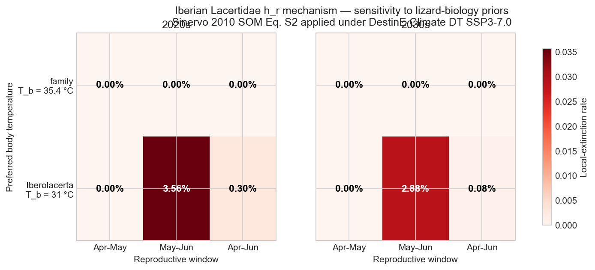
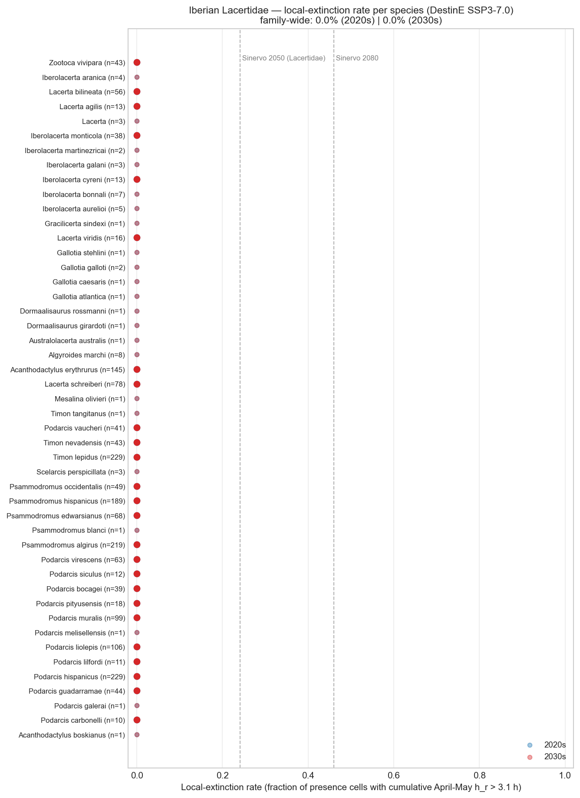
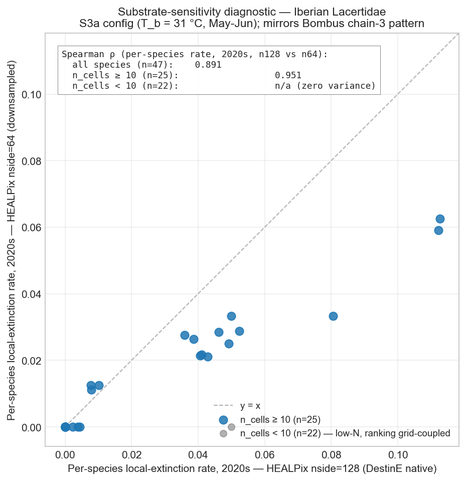
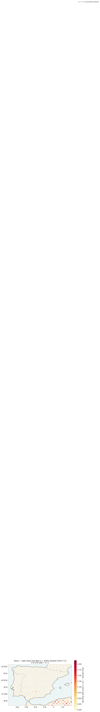
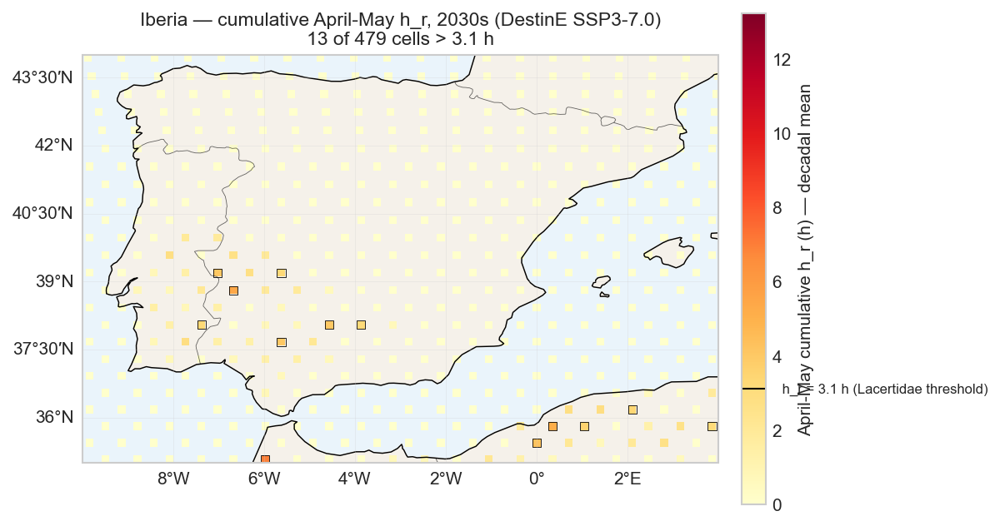

# Results

Phase 3 figures from the Iberian Lacertidae h_r mechanism replication under Destination Earth Climate DT SSP3-7.0 (2020-2039). All figures regenerate from `snakemake --cores 1 figures` after a successful pipeline run.

---

## Figure 1 — Sensitivity matrix (headline)

The mechanism's behaviour is **prior-conditional**. Single-axis perturbations of the lizard-biology priors (just `T_b`, or just the reproductive window) keep the predicted local-extinction rate at 0 %. Only the compound worst-plausible prior (Iberolacerta-style cool-adapted `T_b = 31 °C` combined with the actual Iberian *Podarcis* / *Iberolacerta* May-June breeding chronology) flags ~3 % of Lacertidae cell-years — tail-dominated by single-year extremes rather than monotonic decadal warming.

---

## Figure 2 — Per-species local-extinction rate (S3a config)

Per-species rates under the worst-plausible compound prior (S3a: `T_b = 31 °C`, May-June window). Well-sampled species (`n_cells ≥ 10`) in solid red; low-N species in faded grey (their rates are grid-coupled per Lobo et al. 2007 and Hurlbert & Jetz 2007). Sinervo Table 1 Lacertidae 2050 / 2080 reference values shown as vertical dashed lines for horizon-context.

The baseline-config variant of this figure is omitted: every species sits at 0 % under family-mean `T_b` + April-May, which the sensitivity heatmap already shows compactly.

---

## Figure 3 — Substrate-sensitivity diagnostic

Mirrors the Bombus chain-3 pattern (`weatherxbiodiversity-substrate-sensitivity`). Per-species 2020s rates at HEALPix nside=128 (DestinE-native substrate) vs nside=64 (downsampled via the NESTED bit-shift parent = pix >> 2). Diagonal is `y = x`; deviation = substrate-coupled ranking. **Spearman ρ = 0.951 for well-sampled species (n_cells ≥ 10)**, confirming substrate-robust rankings for the population the rare-species ranking caveat does *not* apply to. The low-N subset (n_cells < 10) is degenerate at this signal level (zero variance — all 22 species collapse to 0 % at both substrates), an operational manifestation of the same caveat.

---

## Figures 4 & 5 — Iberia maps of daily-mean h_r per decade

Iberian Peninsula at HEALPix nside=128 NESTED (DestinE-native substrate). Decadal mean of the daily-mean `h_r` (hours of activity restriction) over the April-May reproductive window. Cells rendered as HEALPix tiles via the EOPF-DGGS [`healpix-plot`](https://github.com/EOPF-DGGS/healpix-plot) library — the DOMAIN.md-canonical replacement for ad-hoc `ang2pix + pcolormesh` bridges.

Spatial pattern: warmest h_r cells cluster in SW Spain (Andalusia, ~37–38 °N, 6–4 °W) and the south-coast strip — physically plausible (warmest April-May in Iberia). Maximum decadal-mean `h_r` reaches ~0.11 h at the warmest cells, well below the Lacertidae family-calibrated threshold of 3.1 h, consistent with the 0 % baseline rate in the sensitivity matrix.

### 2020s

### 2030s

---

## Reading these figures together

The sensitivity matrix (Figure 1) is the headline: under any single-axis prior perturbation, the mechanism predicts zero local extinction at DestinE-reachable horizons. Only the compound worst-plausible (Iberolacerta + May-June) produces a small signal.

The maps (Figures 4 & 5) confirm spatially: even the warmest Iberian cells in April-May reach `h_r ≈ 0.1 h`, well below the 3.1 h family threshold. There is no Lacertidae cell anywhere in the Iberian Peninsula whose 2020-2039 April-May daily-mean `h_r` reaches the threshold.

The S3a per-species figure (Figure 2) identifies which species *would* be most-at-risk if the cool-adapted Iberolacerta T_b + actual Iberian breeding chronology turned out to be the right parameterisation. The substrate-sensitivity diagnostic (Figure 3) confirms those rankings are robust between HEALPix nside=128 and nside=64 for well-sampled species.

For the full prose Outcome — including limitations, prior-conditional caveats, and the cross-taxon Bombus comparison — see the published FORRT nanopublication chain on [platform.sciencelive4all.org](https://platform.sciencelive4all.org).
